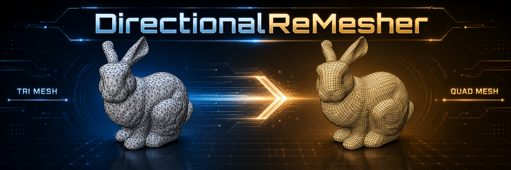

# DirectionalReMesher

DirectionalReMesher is a focused remeshing fork of [Directional](https://github.com/avaxman/Directional), the directional-field processing library developed by Amir Vaxman and collaborators.

It provides a practical C++20 implementation of the cross-field-guided remeshing pipeline described in [Directional Field Synthesis, Design, and Processing](https://cims.nyu.edu/gcl/papers/DirectionalFieldsSTAR-2016.pdf).

The project converts triangle meshes into quad-dominant meshes whose edges follow a directional field defined across the surface. A field can be generated automatically from the input geometry or supplied by the user.

Compared with the original implementation, this fork adds:

* a reusable shared C++ library
* Python bindings
* an optional native command-line interface
* a shared C++ backend used by both CLIs
* multiple sparse integration solver backends
* expanded diagnostics and validation
* progress reporting for long-running operations
* additional mesh and field input/output formats

## Features

* Generate quad-dominant meshes from triangle meshes
* Align generated mesh edges with a cross-field
* Automatically calculate smooth 4-RoSy power fields
* Automatically calculate curvature-aligned cross-fields
* Remesh using a user-provided cross-field
* Import and export multiple mesh and field formats
* Use optimized sparse solvers for the integration stage
* Access the same remeshing pipeline through C++, Python, or the native CLI

## Basic Workflow

1. Select an input triangle mesh
2. Choose how the guiding field will be obtained

   * automatically generate a smooth power field
   * automatically generate a curvature-aligned cross-field
   * provide an existing 4-RoSy cross-field
3. Configure the target edge length and remeshing options
4. Generate the quad-dominant output mesh

## Choosing a Field

The guiding field determines the preferred orientation of the generated mesh edges.

### Automatically calculated field

Use an automatically calculated field when you want a fully self-contained remeshing workflow.

This is the simplest option and works well for many smooth or moderately detailed meshes. Results depend on the quality of the input geometry, curvature estimation, boundaries, singularities, and selected parameters.

### User-provided field

Use a supplied field when you need direct control over edge flow.

A carefully designed field can improve alignment around important features such as:

* ridges and valleys;
* anatomical or mechanical structures;
* boundaries;
* sharp features;
* intended deformation directions.

### Neural-assisted field

A neural model can predict a field from learned examples rather than relying only on geometric optimization.

The [NeurCross](https://github.com/akashskypatel/NeurCross) project can be used to generate neural-assisted cross-fields. These fields may better capture high-level structural patterns on suitable meshes, but their quality depends on the model, training data, and similarity between the input mesh and the training examples.

Both auto-generated and neural-generated fields should still be validated before remeshing. They may require smoothing, constraint enforcement, or correction around singularities and boundaries.

## Tips for Better Results

* Start with a clean, manifold triangle mesh whenever possible.
* Remove duplicate vertices, degenerate faces, and disconnected fragments before remeshing.
* Use the lowest input face count that still preserves the required geometry.
* Very dense meshes increase field computation, integration, and mesh-generation time.
* Preserve important geometric features during simplification.
* Adjust the target length ratio to control the approximate size of generated faces.
* Use a custom field when automatic edge flow does not match the intended structure.
* Enable verbose output when diagnosing solver, topology, or field-integration failures.
* Compare multiple field-generation methods when automatic results are unsatisfactory.

## Performance Notes

Remeshing time depends on:

* the number of input vertices and faces;
* the number and placement of field singularities;
* the number of mixed-integer integration iterations;
* the selected sparse solver;
* the requested output resolution;
* the complexity of the generated mesh topology.

The progress percentage may occasionally pause or appear to advance unevenly. Some stages perform iterative refinement, repeated sparse solves, or topology cleanup whose cost cannot be predicted exactly in advance.

For faster processing:

* simplify unnecessarily dense input meshes;
* avoid requesting an excessively small target edge length;
* use an optimized sparse solver backend;
* test the workflow on a lower-resolution copy before processing the final mesh.

## Troubleshooting

If remeshing fails:

1. Run again with verbose output enabled.
2. Check the input mesh for non-manifold edges, duplicate vertices, and degenerate faces.
3. Try a less dense version of the mesh.
4. Increase the target edge length.
5. Try a different field-generation method.
6. Inspect the generated field for discontinuities, poor boundary alignment, or excessive singularities.
7. Supply a custom or neural-assisted field when automatic field generation is unsuitable.

Automatic field generation is intended to provide a useful default, but no single field-generation method is optimal for every mesh.

## Terminology

* **Direction field**: A set of preferred directions defined across a surface. It guides how edges, curves, or quadrilateral faces should be oriented.

* **Cross-field**: A direction field that provides four equivalent directions at each point on the surface, usually separated by 90 degrees. Because rotating the cross by 90 degrees produces the same field, it is well suited to quad remeshing.

* **Curvature-aligned cross-field**: A cross-field whose directions follow the principal curvature directions of the surface. In simple terms, it tends to follow the natural bends, ridges, valleys, and flow of the shape.

* **Power field**: A mathematical representation of a direction field in which rotationally equivalent directions are encoded as a single value. This makes the field easier to smooth and optimize.

* **4-power field**: The power representation commonly used for a four-direction cross-field. Raising the direction representation to the fourth power makes directions that differ by 90 degrees equivalent.

* **Smooth power field**: A power field optimized so that neighboring directions change gradually across the surface. It reduces sudden direction changes, except where singularities or strong geometric features require them.

* **Singularity**: A point where the surrounding field cannot remain perfectly regular. Singularities are expected in cross-fields and often determine where the topology of the final quad mesh changes.

* **Field alignment**: How closely the field follows a chosen target, such as surface curvature, feature lines, boundary edges, or user-specified directions.

* **Field smoothness**: How gradually the field directions change from one part of the surface to another.

## Differences Between Field Types

### Directional calculated cross-field

A Directional calculated cross-field is produced by geometric and numerical algorithms operating directly on the input mesh.

It typically:

* uses the mesh shape, curvature, boundaries, and optional constraints;
* solves an optimization problem to create a smooth and consistent field;
* follows mathematically defined behavior;
* produces predictable and reproducible results;
* may require more computation on large or complex meshes.

In simple terms:

> Directional examines the surface geometry and calculates a field that is mathematically smooth and suitable for quad remeshing.

This is usually the most reliable option when geometric accuracy and reproducibility are important.

### Neural-generated cross-field

A neural-generated cross-field is predicted by a trained machine-learning model.

It typically:

* learns field patterns from example meshes and training data;
* predicts directions directly from mesh features;
* can be much faster after the model has been trained;
* may recognize structural patterns that are difficult to express with fixed rules;
* depends heavily on the quality and variety of its training data;
* may produce less predictable results on shapes unlike those seen during training.

In simple terms:

> A neural model looks at the mesh and predicts what a good cross-field should look like based on examples it learned from.

This can be useful for fast initial estimates or for reproducing design patterns learned from a dataset. The predicted field may still need smoothing, constraint enforcement, or numerical correction before remeshing.

### Power field

A power field is not necessarily a separate source of field directions. It is primarily a different mathematical representation of a directional or neural-generated field.

It typically:

* removes ambiguity between directions that are rotationally equivalent;
* makes smoothing and optimization easier;
* allows a four-direction cross-field to be represented as one continuous mathematical quantity;
* must be converted back into explicit cross directions before visualization or remeshing.

In simple terms:

> A power field is a convenient mathematical encoding of a cross-field, rather than a different kind of geometric guidance.

For a four-direction cross-field, the fourth-power representation treats all four arms of the cross as the same orientation.

### Practical Comparison

| Field type                         | How it is produced                               | Main advantage                                     | Main limitation                                                 |
| ---------------------------------- | ------------------------------------------------ | -------------------------------------------------- | --------------------------------------------------------------- |
| Directional calculated cross-field | Numerical optimization based on mesh geometry    | Reliable, reproducible, and geometrically grounded | Can be computationally expensive                                |
| Neural-generated cross-field       | Prediction from a trained neural network         | Fast and capable of learning complex patterns      | Quality depends on training data and may require correction     |
| Power field                        | Mathematical encoding of another direction field | Easier to smooth, optimize, and store              | Not directly the final visible cross-field                      |
| Curvature-aligned cross-field      | Built or constrained to follow surface curvature | Follows natural ridges, valleys, and shape flow    | Curvature can be noisy or ambiguous on flat and irregular areas |
| Smooth power field                 | Power field after smoothness optimization        | Produces gradual and coherent direction changes    | Excessive smoothing can weaken important features               |

### Simple Mental Model

Think of a quad-remeshing field as a set of compass crosses placed across the surface.

* A **Directional calculated cross-field** places and adjusts those crosses using geometric rules and numerical optimization.
* A **neural-generated cross-field** predicts where the crosses should point based on previously learned examples.
* A **power field** is the mathematical format used to represent those crosses without having to distinguish between their four equivalent arms.
* A **curvature-aligned field** turns the crosses so they follow the natural bends and features of the surface.
* A **smooth field** ensures neighboring crosses rotate gradually rather than changing direction abruptly.

## Build outputs

The top-level project can build:

1. `directional` — shared C++ library
2. `_directional` — Python extension module
3. `directional_cli` — optional native executable installed as `directional`
4. `directional_cli_backend` — shared C++ command implementation used by both CLIs

The Python console script and native executable intentionally expose the same commands and option parsing through the C++ CLI backend.

## Requirements

### Native build

- CMake 3.21 or newer
- C++20-capable compiler
- Git submodules initialized, including Eigen
- Python only when building Python bindings or invoking `setup.py`

### Python build

Python 3.13 is verified in this repository. Install the build dependencies with:

```powershell
python -m pip install setuptools wheel pybind11
```

For PEP 517 builds, install any additional requirements declared by the project build configuration or disable build isolation when the active environment already contains them.

## Dependencies

### Eigen

Eigen is required and included as a repository submodule.

```powershell
git submodule update --init --recursive
```

### GMP

GMP is optional and enables the preferred exact-arithmetic implementation.

- CMake option: `DIRECTIONAL_ENABLE_GMP`
- Default: `ON`
- MSVC builds can auto-install it when it is not already available
- Other platforms should provide GMP and GMPXX through the system or toolchain

When GMP cannot be found, CMake emits a warning and continues without GMP.

### Integration solver backends

DirectionalReMesher supports three optional integration solver backends:

- Intel oneMKL PARDISO
- NVIDIA cuDSS
- SuiteSparse / UMFPACK

Only one backend is enabled in a build. If more than one is requested, both CMake and `setup.py` emit a warning and select the first available request in this fixed order:

```text
PARDISO > CUDSS > SUITESPARSE
```

Relevant CMake options:

```text
DIRECTIONAL_ENABLE_PARDISO=ON|OFF
DIRECTIONAL_ENABLE_CUDSS=ON|OFF
DIRECTIONAL_ENABLE_SUITESPARSE=ON|OFF
CUDSS_ROOT=<path>
```

CMake defaults are:

```text
PARDISO=OFF
CUDSS=OFF
SUITESPARSE=ON
```

The current `setup.py` defaults request all three backends and therefore resolve to PARDISO unless overridden.

#### PARDISO

PARDISO uses Intel oneMKL and is the highest-priority backend. On supported MSVC builds, the dependency logic can install oneMKL automatically. Required runtime modules are copied beside the native library, native CLI, and Python extension during build and install.

#### cuDSS

cuDSS requires an NVIDIA cuDSS installation and the imported CMake target `CUDSS::cudss`. Set `CUDSS_ROOT` when automatic discovery is insufficient.

Example:

```powershell
cmake -S . -B build\cudss `
  -DDIRECTIONAL_ENABLE_PARDISO=OFF `
  -DDIRECTIONAL_ENABLE_CUDSS=ON `
  -DDIRECTIONAL_ENABLE_SUITESPARSE=OFF `
  -DCUDSS_ROOT="C:\Program Files\NVIDIA cuDSS\v0.8"
```

#### SuiteSparse

SuiteSparse is the default CMake backend. Supported MSVC builds can auto-install it when necessary. Other platforms should provide a usable SuiteSparse package or CMake configuration.

## CMake options

| Option | Default | Purpose |
|---|---:|---|
| `BUILD_PYTHON` | `OFF` | Build the Python extension |
| `DIRECTIONAL_BUILD_CLI` | `OFF` | Build the native CLI executable |
| `DIRECTIONAL_ENABLE_GMP` | `ON` | Enable GMP exact arithmetic |
| `DIRECTIONAL_ENABLE_SUITESPARSE` | `ON` | Request SuiteSparse |
| `DIRECTIONAL_ENABLE_PARDISO` | `OFF` | Request Intel oneMKL PARDISO |
| `DIRECTIONAL_ENABLE_CUDSS` | `OFF` | Request NVIDIA cuDSS |
| `CUDSS_ROOT` | empty | cuDSS installation root |
| `CMAKE_INSTALL_PREFIX` | platform default | Installation destination |

## Native CMake builds

### Shared library with SuiteSparse

```powershell
cmake -S . -B build\standalone `
  -DCMAKE_INSTALL_PREFIX="$PWD\build\standalone\install" `
  -DBUILD_PYTHON=OFF `
  -DDIRECTIONAL_BUILD_CLI=OFF `
  -DDIRECTIONAL_ENABLE_GMP=ON `
  -DDIRECTIONAL_ENABLE_PARDISO=OFF `
  -DDIRECTIONAL_ENABLE_CUDSS=OFF `
  -DDIRECTIONAL_ENABLE_SUITESPARSE=ON

cmake --build build\standalone --config Release --target directional
cmake --install build\standalone --config Release
```

### Shared library with PARDISO

```powershell
cmake -S . -B build\pardiso `
  -DCMAKE_INSTALL_PREFIX="$PWD\build\pardiso\install" `
  -DBUILD_PYTHON=OFF `
  -DDIRECTIONAL_ENABLE_PARDISO=ON `
  -DDIRECTIONAL_ENABLE_CUDSS=OFF `
  -DDIRECTIONAL_ENABLE_SUITESPARSE=OFF

cmake --build build\pardiso --config Release --target directional
cmake --install build\pardiso --config Release
```

### Native CLI

```powershell
cmake -S . -B build\native-cli `
  -DCMAKE_INSTALL_PREFIX="$PWD\build\native-cli-release" `
  -DBUILD_PYTHON=OFF `
  -DDIRECTIONAL_BUILD_CLI=ON `
  -DDIRECTIONAL_ENABLE_PARDISO=ON

cmake --build build\native-cli --config Release --target directional_cli
cmake --install build\native-cli --config Release
```

The installed executable is normally:

```text
<install-prefix>/bin/directional.exe
```

Run:

```powershell
directional --help
directional info
```

### Python extension through CMake

```powershell
python -m pip install pybind11
$pybind11Dir = python -m pybind11 --cmakedir

cmake -S . -B build\python `
  -DCMAKE_INSTALL_PREFIX="$PWD\build\python\install" `
  -DBUILD_PYTHON=ON `
  -DDIRECTIONAL_BUILD_CLI=OFF `
  -Dpybind11_DIR="$pybind11Dir" `
  -DDIRECTIONAL_ENABLE_PARDISO=ON

cmake --build build\python --config Release --target _directional
cmake --install build\python --config Release
```

The extension and Python package files are installed beneath:

```text
build/python/install/directional/
```

### Consume the installed C++ package

```cmake
find_package(Directional CONFIG REQUIRED)
target_link_libraries(your_target PRIVATE Directional::directional)
```

For a nonstandard installation prefix:

```powershell
cmake -S . -B build `
  -DCMAKE_PREFIX_PATH="D:\path\to\DirectionalReMesher\build\standalone\install"
```

## `setup.py` builds

`setup.py` forwards build features to CMake and uses the same solver-selection priority.

### Feature flags

```text
--enable-gmp / --disable-gmp
--enable-suitesparse / --disable-suitesparse
--enable-pardiso / --disable-pardiso
--enable-cudss / --disable-cudss
--build-cli / --no-build-cli
```

### Standalone library

```powershell
python setup.py standalone
```

Default paths:

```text
build tree:   build/standalone/
install tree: build/standalone/install/
```

Build the library and native CLI together:

```powershell
python setup.py standalone --build-cli
```

Select a solver explicitly:

```powershell
python setup.py standalone `
  --enable-pardiso `
  --disable-cudss `
  --disable-suitesparse `
  --build-cli
```

### Python extension and wheel

Build the extension:

```powershell
python setup.py build_ext
```

Build a wheel:

```powershell
python setup.py bdist_wheel
```

Pass feature flags through `build_ext` when creating a wheel:

```powershell
python setup.py build_ext `
  --enable-pardiso `
  --disable-cudss `
  --disable-suitesparse `
  bdist_wheel
```

Build and package the native executable with the wheel:

```powershell
python setup.py build_ext --build-cli bdist_wheel
```

When enabled, the installed native CLI and its runtime dependency closure are packaged beneath:

```text
directional/bin/
```

The Python console script remains available as `directional` and forwards commands to the same C++ backend through the extension module.

## PEP 517 and `pip`

The custom build backend accepts short and namespaced configuration keys.

| Short key | Namespaced key | Environment variable |
|---|---|---|
| `enable-gmp` | `directional.enable-gmp` | `DIRECTIONAL_ENABLE_GMP` |
| `enable-suitesparse` | `directional.enable-suitesparse` | `DIRECTIONAL_ENABLE_SUITESPARSE` |
| `enable-pardiso` | `directional.enable-pardiso` | `DIRECTIONAL_ENABLE_PARDISO` |
| `enable-cudss` | `directional.enable-cudss` | `DIRECTIONAL_ENABLE_CUDSS` |
| `build-cli` | `directional.build-cli` | `DIRECTIONAL_BUILD_CLI` |

Boolean values accept:

```text
1, 0, on, off, true, false, yes, no
```

### Basic install

```powershell
python -m pip install . --no-build-isolation
```

### Build a PARDISO wheel

```powershell
python -m pip wheel . `
  --no-deps `
  --no-build-isolation `
  -Cdirectional.enable-pardiso=true `
  -Cdirectional.enable-cudss=false `
  -Cdirectional.enable-suitesparse=false
```

### Build a wheel containing the native CLI

```powershell
python -m pip wheel . `
  --no-deps `
  --no-build-isolation `
  -Cdirectional.build-cli=true
```

### Environment-variable configuration

```powershell
$env:DIRECTIONAL_ENABLE_GMP = "1"
$env:DIRECTIONAL_ENABLE_PARDISO = "1"
$env:DIRECTIONAL_ENABLE_CUDSS = "0"
$env:DIRECTIONAL_ENABLE_SUITESPARSE = "0"
$env:DIRECTIONAL_BUILD_CLI = "1"

python -m pip wheel . --no-build-isolation
```

The legacy GMP environment variable `DIRECTIONAL_DIRECTIONAL_ENABLE_GMP` remains accepted as an alias.

## Command-line interface

Both the Python command and native executable support the same command set:

```text
directional info
directional cross-field <input.obj|input.off> <output-field> [options]
directional convert-field <input-field> <output-field> [options]
directional remesh <input.obj|input.off> <output.obj|output.off> [options]
directional --version
directional --help
```

The Python module form is also supported:

```powershell
python -m directional --help
```

### Field formats

| Format | Extensions | Description |
|---|---|---|
| `crossfield` | `.vec`, `.txt` | Alpha and beta vectors; six values per row |
| `rosy` | `.rosy` | Count/degree header followed by one alpha vector per face |
| `rawfield` | `.rawfield` | Degree/count header followed by `3 × degree` values per face |

### Extract a cross field

```powershell
directional cross-field input.obj output.rosy `
  --output-format rosy `
  --singularities output.sings
```

Options:

```text
--output-format <auto|crossfield|rosy|rawfield>
--no-normalize-directions
--no-normalize
--no-matching
--singularities <path>
--diagnostics-prefix <prefix>
--verbose
```

### Convert a field

```powershell
directional convert-field input.rosy output.txt `
  --input-format rosy `
  --output-format crossfield `
  --mesh input.obj
```

Options:

```text
--input-format <auto|crossfield|rosy|rawfield>
--output-format <auto|crossfield|rosy|rawfield>
--mesh <input.obj|input.off>
--degree <2|4>
```

The mesh is required when conversion must reconstruct beta directions from face normals.

### Remesh

Compute a cross field automatically and remesh:

```powershell
directional remesh input.obj output.obj --length-ratio 0.02
```

Use an existing field:

```powershell
directional remesh input.obj output.off `
  --field input.rosy `
  --field-format rosy `
  --length-ratio 0.02
```

Options:

```text
--field <path>
--field-format <auto|crossfield|rosy|rawfield>
--raw-field <path>
--primary-directions <path>
--secondary-directions <path>
--length-ratio <value>
--no-integral-seamless
--round-seams
--no-normalize-directions
--diagnostics-prefix <prefix>
--verbose
```

Without `--verbose`, long-running remeshing stages use in-place top-level progress reporting. With `--verbose`, detailed phase timing and solver diagnostics are printed as regular log lines.

## Python API

The extension exposes the headless remeshing API, including:

```text
directional.RemeshOptions
directional.RemeshResult
directional.remesh_from_cross_field(...)
directional.remesh_from_raw_cross_field(...)
```

Minimal example:

```python
import numpy as np
import directional

vertices = np.array(
    [
        [0.0, 0.0, 0.0],
        [1.0, 0.0, 0.0],
        [0.0, 1.0, 0.0],
    ],
    dtype=np.float64,
)
faces = np.array([[0, 1, 2]], dtype=np.int32)
primary_directions = np.array([[1.0, 0.0, 0.0]], dtype=np.float64)

options = directional.RemeshOptions()
result = directional.remesh_from_cross_field(
    vertices,
    faces,
    primary_directions,
    options,
)

print(result.success)
```

## Tests

Install test dependencies and run the Python tests:

```powershell
python -m pip install -e .[test] --no-build-isolation
python -m pytest
```

For native validation, configure and build the desired CMake targets, then run any CTest targets included by the current source tree:

```powershell
ctest --test-dir build\standalone -C Release --output-on-failure
```

## Installation layout

A native install typically contains:

```text
bin/                       directional executable and runtime DLLs
lib/                       directional import/static artifacts
include/                   Directional and Eigen headers
lib/cmake/Directional/     exported CMake package
```

A Python install contains:

```text
directional/
  __init__.py
  _directional*.pyd|so
  bin/                     optional native CLI and runtime files
```

## Recommended workflows

Use direct CMake when:

- embedding DirectionalReMesher into another C++ project
- producing an installed `find_package`-compatible package
- controlling dependency discovery and runtime deployment directly

Use `setup.py` when:

- iterating locally on the Python extension
- building the standalone library through a Python command
- building the optional native CLI alongside the extension

Use PEP 517 / `pip` when:

- producing standard wheels
- integrating with build automation
- controlling solver and CLI options through `--config-settings`

## Notes

- Only one integration solver backend is compiled into a build.
- The selection priority is always PARDISO, then cuDSS, then SuiteSparse.
- The C++ package exports `Directional::directional`.
- Python wheels are platform-specific because they contain a compiled extension.
- PARDISO builds deploy the oneMKL runtime modules needed by `mkl_rt` beside installed binaries.
- The native CLI and Python CLI share the same C++ implementation; command behavior should remain consistent between them.

## Citation

Original source: [avaxman/Directional](https://github.com/avaxman/Directional)

If you use this project in research, cite the original Directional work:

```bibtex
@misc{Directional,
  author = {Amir Vaxman and others},
  title = {Directional: A library for Directional Field Synthesis, Design, and Processing},
  doi = {10.5281/zenodo.3338174},
  url = {https://doi.org/10.5281/zenodo.3338174}
}
```
